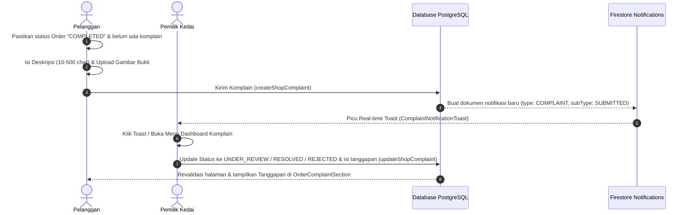

# Konteks Sistem Komplain Canteeners

Dokumen ini mendokumentasikan skema database komplain, fitur pengajuan komplain pelanggan, dashboard manajemen komplain pemilik kedai, integrasi notifikasi real-time, serta penanganan validasi dan moderasi teks.

---

## 1. Skema Database (Prisma Schema)

Model komplain didefinisikan dalam [shop.prisma](file:///home/dwiwahyuilahi/Personal/Projects/Canteeners/source-code/canteeners-main/prisma/schema/shop.prisma) dan berelasi secara 1-to-1 dengan model `Order` di [order.prisma](file:///home/dwiwahyuilahi/Personal/Projects/Canteeners/source-code/canteeners-main/prisma/schema/order.prisma).

### A. Model `ShopComplaint`
Menyimpan informasi utama pengajuan komplain dari pelanggan terhadap pesanan kedai.
- `id` (String, default: `nanoid()`): ID unik komplain.
- `created_at` (DateTime, default: `now()`): Waktu ketika komplain diajukan.
- `order_id` (String, Unique): ID order yang dirujuk (relasi Cascade dengan tabel `Order`).
- `proof_url` (String, Optional): Nama file/URL bukti komplain (disimpan di folder `complaint-proof`).
- `cause` (String, `@db.Text`): Deskripsi detail keluhan dari pelanggan.
- `feedback` (String, Optional, `@db.Text`): Tanggapan/balasan dari pihak pemilik kedai.
- `status` (`ShopComplaintStatus`, default: `PENDING`): Status penanganan komplain.

### B. Enum `ShopComplaintStatus`
Mencerminkan siklus hidup (*lifecycle*) dari pengajuan komplain:
- `PENDING`: Baru dibuat oleh pelanggan, belum ditinjau oleh pihak kedai.
- `UNDER_REVIEW`: Sedang diperiksa oleh pemilik kedai (misal: memeriksa foto bukti, detail pesanan, dll).
- `RESOLVED`: Selesai ditangani oleh kedai (masalah dianggap tuntas, dapat berupa pengembalian dana melalui refund atau penyelesaian mandiri lainnya).
- `REJECTED`: Ditolak oleh kedai (karena klaim tidak valid atau tidak memiliki cukup bukti).
- `ESCALATED`: Kasus naik ke admin kantin/platform karena perselisihan atau butuh penanganan manual pihak ketiga.

---

## 2. Alur Pengajuan Komplain (Sisi Pelanggan)

Pengajuan komplain dapat diakses di halaman detail pesanan pelanggan apabila syarat terpenuhi.

### A. Aturan Pengajuan
Pelanggan dapat mengajukan komplain melalui halaman [OrderComplaintPage](file:///home/dwiwahyuilahi/Personal/Projects/Canteeners/source-code/canteeners-main/src/app/order/[order_id]/komplain/page.tsx) dengan kondisi:
1. Status pesanan telah selesai (`order.status === "COMPLETED"`).
2. Pesanan tersebut belum memiliki komplain yang terdaftar (`order.complaint` bernilai `null`).

### B. Formulir Pengajuan ([CreateComplaintForm](file:///home/dwiwahyuilahi/Personal/Projects/Canteeners/source-code/canteeners-main/src/features/shop/complaint/ui/create-complaint-form.tsx))
Formulir menggunakan `react-hook-form` dengan validasi `zod` melalui schema `ShopComplaintSchema` di [complaint-schema.ts](file:///home/dwiwahyuilahi/Personal/Projects/Canteeners/source-code/canteeners-main/src/features/shop/complaint/types/complaint-schema.ts):
- **Deskripsi Keluhan (`cause`)**: Wajib diisi dengan panjang minimal **10 karakter** dan maksimal **500 karakter**.
- **Moderasi Kata Kasar**: Teks deskripsi divalidasi menggunakan helper `containsBadWords` dari [contains-bad-words.ts](file:///home/dwiwahyuilahi/Personal/Projects/Canteeners/source-code/canteeners-main/src/lib/moderation/contains-bad-words.ts). Jika mengandung kata terlarang, formulir akan menampilkan pesan error *"Mengandung ujaran kebencian"*.
- **Unggah Bukti (`proof_url` - Opsional)**: Menggunakan komponen `FileUploadImage` untuk mengirim gambar bukti keluhan ke server API `/api/upload` dengan menyematkan payload FormData `path: "complaint-proof"`. Nama file gambar yang tersimpan kemudian dimasukkan ke field `proof_url`.

### C. Pembuatan Komplain (`createShopComplaint`)
Setelah validasi lolos, server action `createShopComplaint` di [complaint-actions.ts](file:///home/dwiwahyuilahi/Personal/Projects/Canteeners/source-code/canteeners-main/src/features/shop/complaint/lib/complaint-actions.ts#L17-L73) akan dijalankan untuk:
1. Menyimpan data `ShopComplaint` baru ke database PostgreSQL.
2. Mengirimkan notifikasi Firestore ke pemilik kedai terkait.

---

## 3. Manajemen & Tanggapan Komplain (Sisi Kedai)

Pemilik kedai dapat memantau dan menanggapi keluhan pelanggan melalui menu dashboard khusus.

### A. Halaman Dashboard Komplain ([ComplaintsPage](file:///home/dwiwahyuilahi/Personal/Projects/Canteeners/source-code/canteeners-main/src/app/dashboard-kedai/komplain/page.tsx))
Halaman ini bertindak sebagai panel kontrol utama yang menampilkan statistik komplain:
- Menghitung jumlah komplain berdasarkan status (`PENDING`, `UNDER_REVIEW`, `RESOLVED`, `REJECTED`).
- Menampilkan daftar komplain menggunakan komponen [ComplaintsListClient](file:///home/dwiwahyuilahi/Personal/Projects/Canteeners/source-code/canteeners-main/src/features/shop/complaint/ui/complaints-list-client.tsx) yang memuat nama pelanggan, cuplikan keluhan, waktu relatif pembuatan (menggunakan `date-fns` format bahasa Indonesia), badge status, dan *thumbnail* bukti gambar jika tersedia.
- Kartu komplain dapat diklik dan akan mengarahkan pemilik kedai ke halaman detail order terkait di `/dashboard-kedai/order/[order_id]`.

### B. Komponen Detail Komplain ([ShopComplaintSection](file:///home/dwiwahyuilahi/Personal/Projects/Canteeners/source-code/canteeners-main/src/features/order/ui/shop-complaint-section.tsx))
Di dalam detail pesanan kedai, terdapat bagian khusus peninjauan komplain:
- Menampilkan deskripsi keluhan dan bukti gambar (dapat diperbesar menggunakan dialog modal).
- Jika status komplain adalah `PENDING` atau `UNDER_REVIEW` (belum diselesaikan/ditolak), tombol **"Tanggapi"** akan muncul untuk memicu [RespondComplaintDialog](file:///home/dwiwahyuilahi/Personal/Projects/Canteeners/source-code/canteeners-main/src/features/shop/complaint/ui/respond-complaint-dialog.tsx).

### C. Dialog Tanggapan ([RespondComplaintDialog](file:///home/dwiwahyuilahi/Personal/Projects/Canteeners/source-code/canteeners-main/src/features/shop/complaint/ui/respond-complaint-dialog.tsx))
Pemilik kedai dapat memberikan masukan dan merubah status komplain:
- **Tanggapan (`feedback`)**: Wajib diisi dengan panjang minimal **10 karakter** dan maksimal **500 karakter**.
- **Status Baru (`status`)**: Pemilik kedai dapat memilih status transisi berikutnya: `UNDER_REVIEW`, `RESOLVED`, atau `REJECTED`.
- Mengirimkan data ke server action `updateShopComplaint` di [complaint-actions.ts](file:///home/dwiwahyuilahi/Personal/Projects/Canteeners/source-code/canteeners-main/src/features/shop/complaint/lib/complaint-actions.ts#L75-L157).
- Jika sukses, halaman akan direfresh secara otomatis menggunakan `router.refresh()` dan memicu revalidasi jalur caching di Next.js.

> [!NOTE]
> Logika pengiriman notifikasi dari kedai kembali ke pelanggan saat komplain diperbarui (`updateShopComplaint`) saat ini tercatat masih dalam kondisi dinonaktifkan (di-comment) pada baris kode backend server action [complaint-actions.ts:L106-L147](file:///home/dwiwahyuilahi/Personal/Projects/Canteeners/source-code/canteeners-main/src/features/shop/complaint/lib/complaint-actions.ts#L106-L147).

---

## 4. Sistem Notifikasi & Pemantauan Real-time

Sistem mengandalkan Firestore untuk memicu notifikasi visual (toast) secara real-time di aplikasi.

### A. Pengiriman Notifikasi (`createShopComplaint`)
Ketika komplain baru berhasil disimpan di database, server action menulis dokumen baru ke koleksi `/notifications` di Firestore:
```json
{
  "recipientId": "[shop_owner_id]",
  "type": "COMPLAINT",
  "subType": "SUBMITTED",
  "title": "Komplain Baru dari Pelanggan",
  "body": "Pelanggan [nama_pelanggan] mengajukan komplain",
  "isRead": false,
  "intent": "WARNING",
  "resourcePath": "/dashboard-kedai/order/[order_id]",
  "createdAt": "serverTimestamp()",
  "senderInfo": {
    "name": "[nama_pelanggan]",
    "avatar": "[avatar_url]"
  }
}
```

### B. Listener Sisi Klien ([useComplaintNotification](file:///home/dwiwahyuilahi/Personal/Projects/Canteeners/source-code/canteeners-main/src/features/notification/hooks/use-complaint-notification.ts))
React Hook ini berlangganan langsung ke koleksi Firestore:
- Memfilter dokumen dengan kriteria `recipientId === user.uid`, `type === "COMPLAINT"`, dan diurutkan berdasarkan `createdAt` terbaru.
- Melacak perubahan menggunakan `onSnapshot`. Jika mendeteksi notifikasi baru (dengan selisih waktu pembuatan kurang dari 30 detik), ia memicu fungsi callback `onNewNotification`.

### C. Tampilan Toast ([NotificationListener](file:///home/dwiwahyuilahi/Personal/Projects/Canteeners/source-code/canteeners-main/src/features/notification/components/notification-listener.tsx))
- Komponen `NotificationListener` yang berjalan secara global menangkap event notifikasi baru dari hook `useComplaintNotification`.
- Menampilkan toast kustom menggunakan library `sonner` melalui komponen [ComplaintNotificationToast](file:///home/dwiwahyuilahi/Personal/Projects/Canteeners/source-code/canteeners-main/src/features/notification/ui/complaint-notification-toast.tsx).
- Pelanggan/pemilik kedai dapat melihat toast notifikasi komplain tersebut, dan bila diklik akan mengalihkan rute halaman ke detail pesanan yang bersangkutan sesuai dengan `resourcePath` yang dikirim dari database.

---

## 5. Ringkasan Alur Komplain (Visual Diagram)


