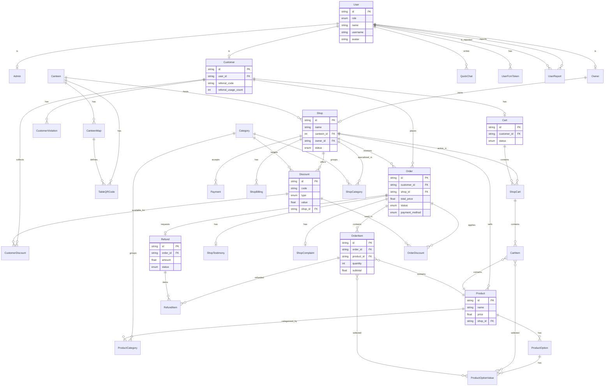

# ERD Canteeners (Mermaid Syntax)

Salin kode di bawah ini dan paste langsung ke Excalidraw atau editor Mermaid lainnya.

```mermaid
erDiagram
    User ||--o| Admin : "is"
    User ||--o| Customer : "is"
    User ||--o| Owner : "is"
    User ||--o{ QuickChat : "writes"
    User ||--o{ UserFcmToken : "has"
    User ||--o{ UserReport : "reports"
    User ||--o{ UserReport : "is_reported"

    Owner ||--o| Shop : "owns"

    Customer ||--o{ CustomerViolation : "has"
    Customer ||--o{ Order : "places"
    Customer ||--o| Cart : "has"
    Customer ||--o{ CustomerDiscount : "collects"

    Canteen ||--o{ Shop : "hosts"
    Canteen ||--o{ CanteenMap : "has"
    Canteen ||--o{ TableQRCode : "has"
    CanteenMap ||--o{ TableQRCode : "defines"

    Shop ||--o{ Product : "sells"
    Shop ||--o{ Order : "receives"
    Shop ||--o{ Discount : "offers"
    Shop ||--o{ Payment : "accepts"
    Shop ||--o{ ShopBilling : "has"
    Shop ||--o{ ShopCart : "active_in"
    Shop ||--o{ ShopCategory : "specialized_in"

    Category ||--o{ ProductCategory : "groups"
    Category ||--o{ ShopCategory : "groups"
    Category ||--o{ Discount : "targets"
    Product ||--o{ ProductCategory : "categorized_by"
    
    Product ||--o{ ProductOption : "has"
    ProductOption ||--o{ ProductOptionValue : "has"

    Cart ||--o{ ShopCart : "contains"
    ShopCart ||--o{ CartItem : "contains"
    CartItem }o--|| Product : "contains"
    CartItem }o--o{ ProductOptionValue : "selected"

    Order ||--o{ OrderItem : "contains"
    Order ||--o| ShopTestimony : "has"
    Order ||--o| ShopComplaint : "has"
    Order ||--o| Refund : "requests"
    Order ||--o{ OrderDiscount : "applies"
    
    OrderItem }o--|| Product : "contains"
    OrderItem }o--o{ ProductOptionValue : "selected"
    OrderItem ||--o{ RefundItem : "refunded"

    Discount ||--o{ OrderDiscount : "used_in"
    Discount ||--o{ CustomerDiscount : "available_for"

    Refund ||--o{ RefundItem : "items"

    User {
        string id PK
        enum role
        string name
        string username
        string avatar
    }

    Customer {
        string id PK
        string user_id FK
        string referral_code
        int referral_usage_count
    }

    Shop {
        string id PK
        string name
        int canteen_id FK
        string owner_id FK
        enum status
    }

    Product {
        string id PK
        string name
        float price
        string shop_id FK
    }

    Order {
        string id PK
        string customer_id FK
        string shop_id FK
        float total_price
        enum status
        enum payment_method
    }

    OrderItem {
        string id PK
        string order_id FK
        string product_id FK
        int quantity
        float subtotal
    }

    Cart {
        string id PK
        string customer_id FK
        enum status
    }

    Discount {
        string id PK
        string code
        enum type
        float value
        string shop_id FK
    }

    Refund {
        string id PK
        string order_id FK
        float amount
        enum status
    }
```
