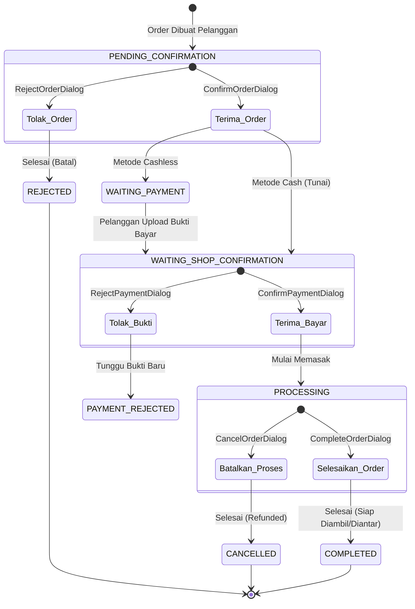

# Konteks Fitur Order Tracking Terpusat Canteeners

Dokumen ini mendokumentasikan fungsionalitas, skema data, arsitektur pemantauan real-time, statistik aktif, serta aksi cepat (*quick actions*) yang tersedia pada halaman pelacakan pesanan terpusat pemilik kedai.

---

## 1. Pendahuluan

Halaman **Order Tracking** ([ShopOrderTrackingPage](file:///home/dwiwahyuilahi/Personal/Projects/Canteeners/source-code/canteeners-main/src/app/dashboard-kedai/order/page.tsx)) merupakan panel kontrol terpusat bagi pemilik kedai untuk melacak, memproses, dan memantau seluruh pesanan aktif yang sedang berjalan secara real-time. Halaman ini dirancang agar pemilik kedai dapat merespons pesanan masuk dengan cepat tanpa harus membuka detail pesanan satu per satu.

---

## 2. Skema Query Data (PostgreSQL)

Data pesanan aktif diambil menggunakan server action `getOrderTrackingData` di [order-queries.ts](file:///home/dwiwahyuilahi/Personal/Projects/Canteeners/source-code/canteeners-main/src/features/order/lib/order-queries.ts#L461-L514).

### Kriteria Filter & Struktur Data
- **Filter Status**: Hanya mengambil pesanan yang berstatus **aktif** (sedang berjalan), dengan mengecualikan status akhir:
  $$\text{status} \notin \{\text{COMPLETED}, \text{REJECTED}, \text{CANCELLED}\}$$
- **Pengurutan**: Diurutkan berdasarkan waktu pembaruan terakhir secara menaik (`updated_at: "asc"`), memastikan pesanan terlama atau yang paling membutuhkan perhatian berada di posisi teratas.
- **Relasi Terkait**:
  - `customer`: Nama pelanggan, nomor meja, dan lantai (untuk rute pengiriman ke meja).
  - `shop`: Mode pencairan dana pengembalian (`refund_disbursement_mode`).
  - `order_items`: Informasi kuantitas dan nama produk.

---

## 3. Sinkronisasi Real-Time (Firestore & React Query)

Untuk meminimalkan latensi dan beban server, halaman ini menggunakan arsitektur hibrida yang menggabungkan rendering sisi server (SSR) dengan sinkronisasi real-time berbasis Firestore.

```
┌─────────────────────────────────┐
│ Server-Side Rendering (SSR)     │ ──> Menampilkan data instan pertama (initialData)
└─────────────────────────────────┘
                 │
                 ▼
┌─────────────────────────────────┐
│ Firestore Subscription          │ ──> Berlangganan perubahan dokumen "/orders"
└─────────────────────────────────┘
                 │ (Terjadi Perubahan / Pesanan Baru)
                 ▼
┌─────────────────────────────────┐
│ React Query Invalidation        │ ──> queryClient.invalidateQueries(["shop-order-tracking"])
└─────────────────────────────────┘
                 │
                 ▼
┌─────────────────────────────────┐
│ Refetch Database PostgreSQL     │ ──> Data diperbarui secara mulus di latar belakang
└─────────────────────────────────┘
```

1. **Initial SSR Data**: Data awal diambil di sisi server melalui `getOrderTrackingPage` dan dioper ke komponen klien sebagai `initialData`. Hal ini mencegah kedipan *loading spinner* saat halaman pertama kali dimuat.
2. **Firestore Listener**: Komponen [ShopOrderTrackingClient](file:///home/dwiwahyuilahi/Personal/Projects/Canteeners/source-code/canteeners-main/src/app/dashboard-kedai/order/shop-order-tracking-client.tsx) membuat koneksi *onSnapshot* ke koleksi `orders` di Firestore dengan filter `shopId === shopId`.
3. **Invalidasi Cache**: Setiap kali ada penambahan atau pembaruan pesanan di Firestore (misalnya pelanggan baru saja membayar atau menyelesaikan pesanan), listener akan memicu pembatalan cache (`invalidateQueries`) pada React Query key `["shop-order-tracking", shopId]`. Aplikasi kemudian secara otomatis mengambil data terbaru dari PostgreSQL di latar belakang.

---

## 4. Metrik & Statistik Aktif

Pada bagian atas halaman, terdapat panel metrik ringkasan yang dikalkulasi secara dinamis dari daftar pesanan aktif:

| Metrik | Sumber Kondisi / Status Pesanan | Keterangan |
| :--- | :--- | :--- |
| **Diterima** | `status === "PROCESSING"` | Pesanan yang sedang dalam tahap memasak/persiapan oleh kedai. |
| **Konfirmasi** | `status === "PENDING_CONFIRMATION"` | Pesanan baru masuk yang belum disetujui/ditolak kedai. |
| **Pembayaran** | `status` dalam `["WAITING_PAYMENT", "WAITING_SHOP_CONFIRMATION"]` | Pesanan yang sedang menunggu pembayaran dari pelanggan atau menunggu konfirmasi bukti bayar oleh kedai. |
| **Terlambat** | `status === "PROCESSING"` & `now > (processed_at + estimation)` | Pesanan aktif yang waktu pengerjaannya telah melampaui estimasi menit yang ditentukan. Jumlah akan menyala **merah (destructive)** jika $> 0$. |

---

## 5. Antarmuka Komponen & Aksi Cepat (Collapsible Accordion)

Daftar pesanan disusun menggunakan komponen **Accordion** yang dapat diperluas untuk menampilkan informasi mendalam dan jalan pintas aksi tanpa perlu berpindah halaman:

### A. Tampilan Header Accordion
- **Informasi Utama**: Nama pelanggan, ringkasan nama item beserta kuantitas (misal: `2x Nasi Goreng, 1x Es Teh`), dan badge status pesanan.
- **Rute Pengantaran**: Menampilkan label nomor meja dan lantai (misal: `Lt 2 - Meja 4`) jika pesanan bertipe `DELIVERY_TO_TABLE`.
- **Countdown Estimasi**: Menampilkan hitung mundur sisa waktu pembuatan pesanan secara real-time via komponen `OrderEstimationCountDown` jika pesanan sedang diproses.

### B. Panel Detail & Aksi Cepat (Di dalam Accordion Content)
Pemilik kedai dapat langsung mengeksekusi transisi status pesanan melalui tombol-tombol aksi cepat berikut:

1. **Status `PENDING_CONFIRMATION`**
   - **Aksi Tolak**: Memicu dialog `RejectOrderDialog` untuk membatalkan pesanan masuk disertai alasan penolakan.
   - **Aksi Terima**: Memicu dialog `ConfirmOrderDialog` untuk menyetujui pesanan dan menentukan estimasi durasi pembuatan (menit).

2. **Status `WAITING_SHOP_CONFIRMATION`**
   - **Metode Tunai (CASH)**: Menampilkan tombol konfirmasi penerimaan uang fisik (`ConfirmPaymentDialog`).
   - **Metode Non-Tunai (QRIS/Transfer)**: Menampilkan gambar bukti transfer pelanggan (dapat diklik untuk memperbesar via Radix Dialog). Menyediakan tombol `ConfirmPaymentDialog` (Terima) dan `RejectPaymentDialog` (Tolak bukti transfer).

3. **Status `PROCESSING`**
   - **Aksi Selesai**: Menampilkan tombol `CompleteOrderDialog` untuk menandai pesanan selesai dibuat dan siap diserahkan/diantar.
   - **Aksi Batal**: Menampilkan tombol `CancelOrderDialog` untuk pembatalan darurat selama proses pengerjaan (dilengkapi pengembalian dana/refund otomatis sesuai konfigurasi kedai).

4. **Jalur Akses Detail Penuh**
   - Tombol **"Buka Detail"** mengarahkan pengguna ke halaman detail pesanan lengkap di `/dashboard-kedai/order/[order_id]` dengan parameter `back_url` untuk mempermudah kembali ke panel tracking.

---

## 6. Diagram Alur Transisi Status melalui Tracking Terpusat


