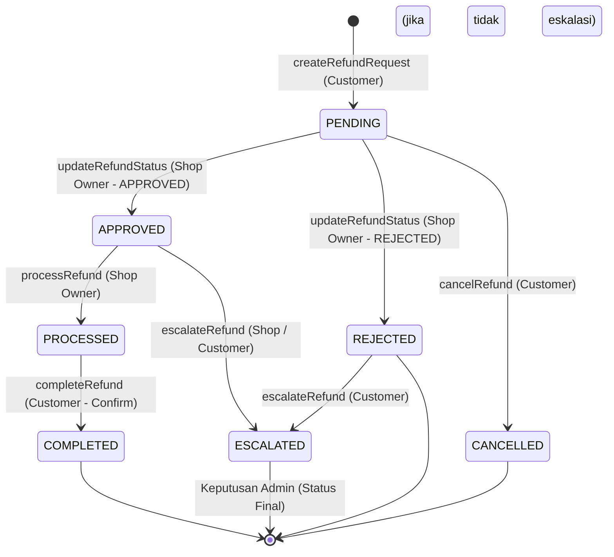

# Konteks Alur Refund Canteeners

Dokumen ini mendokumentasikan skema database, pemetaan konstanta, validasi frontend, alur logika server action, serta efek samping (side effects) dalam sistem refund pada aplikasi Canteeners.

---

## 1. Skema Database (Prisma Schema)

Definisi model refund dapat ditemukan pada [refund.prisma](file:///home/dwiwahyuilahi/Personal/Projects/Canteeners/source-code/canteeners-main/prisma/schema/refund.prisma). Hubungan dan field utama adalah sebagai berikut:

### A. Model `Refund`
Menyimpan informasi utama pengajuan pengembalian dana. Relasinya adalah 1-to-1 dengan model `Order` (setiap order maksimal hanya memiliki 1 refund).
- `id` (String, UUID): ID unik refund.
- `order_id` (String, Unique): ID order yang direfund (relasi Cascade).
- `complaint_proof_url` (String, Optional): URL gambar bukti komplain dari customer.
- `disbursement_proof_url` (String, Optional): URL gambar bukti transfer pembayaran refund oleh kedai.
- `disbursement_mode` (Enum): Cara pengembalian dana (`CASH` atau `TRANSFER`).
- `amount` (Float): Jumlah nominal refund.
- `reason` (Enum): Alasan refund.
- `status` (Enum): Status refund saat ini (default: `PENDING`).
- `description` (String, Optional): Deskripsi keluhan dari customer.
- `requested_at` (DateTime): Waktu pengajuan.
- `processed_at` (DateTime, Optional): Waktu disetujui / diproses kedai.
- `rejected_reason` (String, Optional): Alasan penolakan dari kedai.
- `escalated_reason` (String, Optional): Alasan eskalasi ke admin.
- `affected_items` (`RefundItem[]`): Relasi ke item spesifik yang bermasalah.
- `history` (`RefundHistory[]`): Log riwayat perubahan status refund.

### B. Model `RefundHistory`
Mencatat setiap perubahan status pada refund beserta catatan (note) dan identitas pelaku aksi (aktor).
- `status` (`RefundStatus`): Status setelah perubahan.
- `note` (String, Optional): Catatan perubahan status.
- `actor_id` / `actor_name` / `actor_role`: Snapshot informasi user (Customer, Shop Owner, atau Admin) yang melakukan aksi.

### C. Model `RefundItem`
Menghubungkan refund dengan item-item tertentu dalam pesanan yang bermasalah (many-to-many resolver table).
- `refund_id` & `order_item_id` (Unique composite key): Menjamin satu item pesanan hanya bisa dikaitkan ke satu pengajuan refund.

### D. Enum Lainnya
- **`RefundReason`**:
  - `SHOP_CANCELLATION`: Pembatalan oleh kedai.
  - `LATE_DELIVERY`: Keterlambatan pengiriman (> estimasi).
  - `WRONG_ORDER`: Salah pesanan.
  - `DAMAGED_FOOD`: Makanan rusak/cacat.
  - `MISSING_ITEM`: Item kurang.
  - `OTHER`: Lain-lain.
- **`RefundStatus`**:
  - `PENDING`: Menunggu persetujuan kedai.
  - `APPROVED`: Disetujui kedai, menunggu proses pembayaran/disbursement.
  - `REJECTED`: Ditolak kedai.
  - `PROCESSED`: Dana dikirim oleh kedai, menunggu konfirmasi penerimaan oleh user.
  - `COMPLETED`: Refund selesai (customer telah konfirmasi penerimaan dana).
  - `CANCELLED`: Dibatalkan oleh customer.
  - `ESCALATED`: Masalah dieskalasi ke admin untuk peninjauan lebih lanjut.

---

## 2. Pemetaan Konstanta (Mappings)

Definisi pemetaan label teks bahasa Indonesia untuk enum terdapat di [refund-mapping.ts](file:///home/dwiwahyuilahi/Personal/Projects/Canteeners/source-code/canteeners-main/src/constant/refund-mapping.ts):

* **Alasan (`refundReasonMapping`)**:
  - `SHOP_CANCELLATION` $\rightarrow$ "Pembatalan oleh Kedai"
  - `LATE_DELIVERY` $\rightarrow$ "Keterlambatan Pengiriman"
  - `WRONG_ORDER` $\rightarrow$ "Kesalahan Pesanan"
  - `DAMAGED_FOOD` $\rightarrow$ "Makanan Rusak/Cacat"
  - `MISSING_ITEM` $\rightarrow$ "Item Kurang"
  - `OTHER` $\rightarrow$ "Lain-lain"
* **Status (`refundStatusMapping`)**:
  - `PENDING` $\rightarrow$ "Menunggu Konfirmasi Kedai"
  - `APPROVED` $\rightarrow$ "Disetujui"
  - `REJECTED` $\rightarrow$ "Ditolak"
  - `PROCESSED` $\rightarrow$ "Telah Diproses"
  - `COMPLETED` $\rightarrow$ "Selesai"
  - `CANCELLED` $\rightarrow$ "Dibatalkan Pelanggan"
  - `ESCALATED` $\rightarrow$ "Dieskalasi ke Admin"
* **Mode Pembayaran (`refundDisbursementModeMapping`)**:
  - `CASH` $\rightarrow$ "Tunai"
  - `TRANSFER` $\rightarrow$ "Transfer"

---

## 3. Validasi Form & Logika Frontend

Komponen pembuatan refund berada di [create-refund-form.tsx](file:///home/dwiwahyuilahi/Personal/Projects/Canteeners/source-code/canteeners-main/src/features/shop/refund/ui/create-refund-form.tsx) dan skemanya didefinisikan pada `refund-schema.ts`.

### A. Aturan Berdasarkan Tipe Alasan Refund
Sistem membedakan alur input berdasarkan apakah alasan refund merupakan tingkat item (**Item-Level**) atau tingkat pesanan secara global (**Order-Level**):

* **Item-Level Reasons (`DAMAGED_FOOD`, `MISSING_ITEM`, `WRONG_ORDER`)**:
  - Customer wajib memilih item pesanan mana saja yang bermasalah (`affected_item_ids` minimal 1 item).
  - Nominal refund (`amount`) **dihitung otomatis** dari penjumlahan subtotal item yang dipilih. Input manual `amount` dinonaktifkan/dilarang.
* **Order-Level / Manual Reasons (`LATE_DELIVERY`, `OTHER`)**:
  - Customer wajib menginputkan jumlah nominal refund (`amount`) secara manual.
  - Jumlah refund harus bernilai positif dan tidak boleh melebihi total harga pesanan (`total_price`).
  - Input item yang bermasalah (`affected_item_ids`) tidak digunakan.

### B. Validasi Lainnya
- **Deskripsi keluhan**: Bersifat opsional tetapi jika diisi minimal memiliki panjang 10 karakter dan maksimal 500 karakter.
- **Moderasi Kata Kasar**: Seluruh teks deskripsi disaring menggunakan fungsi `containsBadWords` untuk mencegah ujaran kebencian.
- **Bukti Komplain (`complaint_proof_url`)**: Wajib diunggah oleh customer (maksimal 5MB) dan disimpan menggunakan `LocalStorageService.uploadImage` di folder `complaint-proof`.

---

## 4. Alur Proses Backend (Server Actions)

Logika backend utama berada di [refund-actions.ts](file:///home/dwiwahyuilahi/Personal/Projects/Canteeners/source-code/canteeners-main/src/features/shop/refund/lib/refund-actions.ts). Berikut alur transisinya:

### A. Pengajuan Refund (`createRefundRequest`)
1. Autentikasi dan pengecekan status pesanan (harus `COMPLETED`).
2. Validasi bahwa belum ada data refund untuk `order_id` tersebut.
3. Penghitungan nominal refund sesuai aturan *Item-Level* atau *Order-Level*.
4. Penyimpanan ke database PostgreSQL (`Refund`, `RefundItem`, `RefundHistory`).
5. **Sinkronisasi Firestore**: Menyimpan data ringkasan refund ke dalam koleksi `/refunds/{refundId}` serta memperbarui timestamp pada dokumen order terkait di `/orders/{orderId}`.
6. **Reminders (BullMQ Queue)**: Menjadwalkan pengingat `notify-pending-refund` setelah 12 jam jika belum diproses.
7. **Notifikasi**: Mengirim notifikasi Firestore ke pemilik kedai (`subType: "REQUESTED"`).

### B. Persetujuan/Penolakan (`updateRefundStatus`)
1. Dilakukan oleh Shop Owner untuk status `PENDING`.
2. Validasi apakah admin sudah melakukan intervensi (jika ya, status dikunci).
3. Mengubah status menjadi `APPROVED` atau `REJECTED`.
4. Jika `REJECTED`, wajib menyertakan `rejected_reason`.
5. Sinkronisasi status baru ke Firestore `/refunds/{refundId}`.
6. Notifikasi dikirim ke customer (`subType: "APPROVED"` atau `"REJECTED"`).

### C. Pembayaran / Pengiriman Dana (`processRefund`)
1. Dilakukan oleh Shop Owner setelah status refund disetujui (`APPROVED`).
2. Status diubah menjadi `PROCESSED`.
3. Mengunggah bukti transfer (`disbursement_proof_url`).
4. Sinkronisasi status ke Firestore.
5. Notifikasi dikirim ke customer (`subType: "DISBURSED"`) yang menyertakan tombol aksi cepat untuk mengonfirmasi penerimaan dana.

### D. Konfirmasi Penyelesaian (`completeRefund`)
1. Dilakukan oleh Customer ketika dana refund sudah diterima.
2. Mengubah status menjadi `COMPLETED`.
3. **Logika Billing (Komisi Platform)**:
   - Apabila refund bertipe *Item-Level* (`affected_items` > 0), sistem memotong/merefund komisi platform secara proporsional.
   - Komisi dihitung dengan rumus:
     $$\text{Selisih Komisi} = \text{KomisiOriginal}(Qty) - \text{KomisiSisa}(Qty - QtyRefunded)$$
   - Mengurangi nilai komisi bersih kedai pada tabel `ShopBilling` untuk minggu berjalan (`net_total` didecrement, `refund_total` diincrement).
4. Sinkronisasi status ke Firestore.

### E. Eskalasi ke Admin (`escalateRefund`)
1. Jika terjadi perselisihan (misal refund ditolak oleh kedai tetapi customer merasa berhak), refund dapat dieskalasi ke admin.
2. Status diubah menjadi `ESCALATED` beserta `escalated_reason`.
3. Setelah admin turun tangan dan memberikan keputusan akhir, status ini bersifat final dan tidak dapat diubah lagi oleh kedai atau customer.
